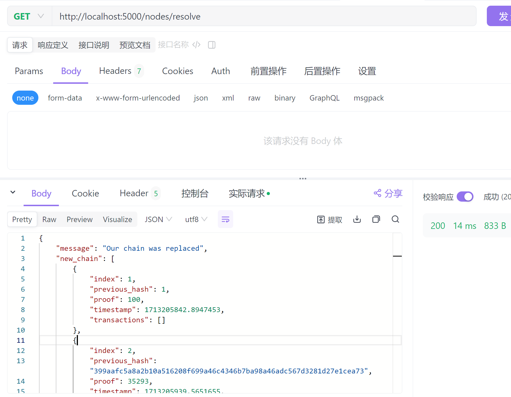

用 Python 从零开始创建区块链.

```
https://learnblockchain.cn/2017/10/27/build_blockchain_by_python/
```

--

### 启动 flask 服务截图


--

### get 接口请求挖矿截图


--

### post 接口添加一个新交易


--

### get 接口查询链信息


## --

### 多个端口模拟多节点网络，观察共识算法。

```
# 多节点启动命令:
python3 blockchain.py 5000
python3 blockchain.py 5001
```

1. post 方式调用`http://localhost:5000/nodes/register` 向节点 1 注册节点 2 的信息，请求体为:

   ```
    {
        "nodes": ["http://localhost:5001"]
    }
   ```

   当前场景只观察节点 1 上的实现效果，故略去向节点 2 注册节点 1 的步骤。

1. 调用`http://localhost:5000/mine` 两次在节点 1 上生成两个区块。
1. 调用`http://localhost:5001/mine` 两次在节点 2 上生成三个区块。
1. 向节点 1 上调用`http://localhost:5000/nodes/resolve` ，观察共识算法。

--

下面截图展示调用 resolve 之前 chain 的查询信息，以及 resolve 的效果。




resove 接口返回体信息:

```
{
    "message": "Our chain was replaced",
    "new_chain": [
        {
            "index": 1,
            "previous_hash": 1,
            "proof": 100,
            "timestamp": 1713205842.8947453,
            "transactions": []
        },
        {
            "index": 2,
            "previous_hash": "399aafc5a8a2b10a516208f699a46c4346b7ba98a46adc567d3281d27e1cea73",
            "proof": 35293,
            "timestamp": 1713205939.5651655,
            "transactions": [
                {
                    "amount": 1,
                    "recipient": "d52ae15cb7df4fe0a6d3ffb57b7734dc",
                    "sender": "0"
                }
            ]
        },
        {
            "index": 3,
            "previous_hash": "16812f954e80175b4999f40aefbc79109d199848d2c6a7310481ca2a3b6eb669",
            "proof": 35089,
            "timestamp": 1713205940.6716533,
            "transactions": [
                {
                    "amount": 1,
                    "recipient": "d52ae15cb7df4fe0a6d3ffb57b7734dc",
                    "sender": "0"
                }
            ]
        },
        {
            "index": 4,
            "previous_hash": "d494cf3fe8341b75b6321510f1087592ca1c7d3fcc9c797fecc615a435f997e1",
            "proof": 119678,
            "timestamp": 1713205942.1483912,
            "transactions": [
                {
                    "amount": 1,
                    "recipient": "d52ae15cb7df4fe0a6d3ffb57b7734dc",
                    "sender": "0"
                }
            ]
        }
    ]
}
```
