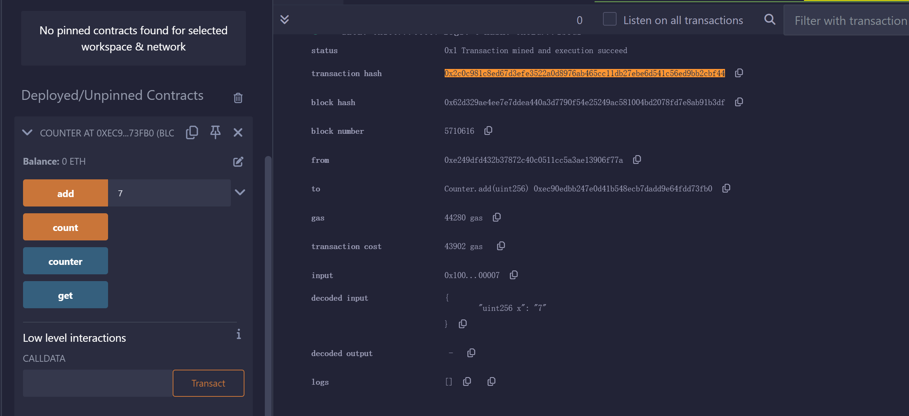

使用 Remix 创建一个 Counter 合约并部署到任意以太坊测试网:
Counter 合约具有

一个状态变量 counter
get()方法: 获取 counter 的值
add(x) 方法: 给变量加上 x 。
请在回答框内提交调用 add(x) 的交易 Hash 的区块链浏览器的 URL。

--

### add 方法截图



--

### add 交易 hash

```
https://sepolia.etherscan.io/tx/0x2c0c981c8ed67d3efe3522a0d8976ab465cc11db27ebe6d541c56ed9bb2cbf44
```
