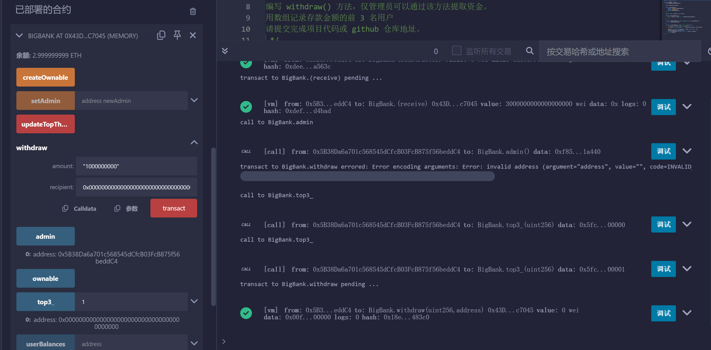
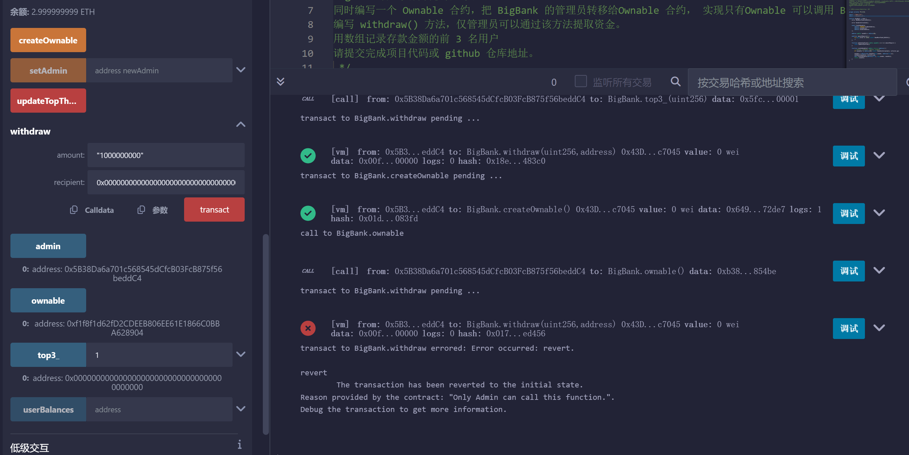
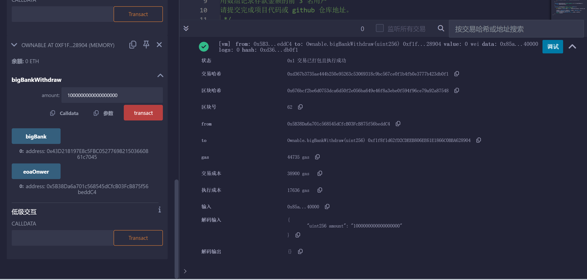
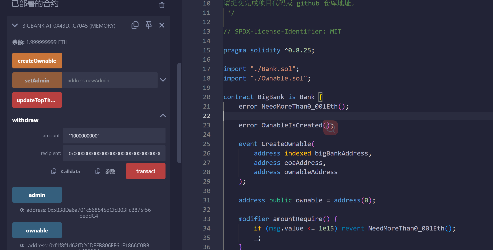

### BigBank 合约代码结构及功能介绍：

1. Bank.sol 实现用户的存款及管理员的提款功能，用户存款时保存其金额并记录 TOP3，在 updateTopThree() 中实现。
2. BigBank.sol 继承 Bank 合约，并扩展存款功能：要求存款时金额需要大于 0.001 ether，因此 Bank 里的 updateTopThree()需要用 virtual 修饰；
3. BigBank.sol 中继承 updateTopThree 方法时，添加 modifier amountRequire()，用于控制存款金额大于 0.001ETH；
4. BigBank.sol 中的 createOwnable()方法，用于创建 Ownable 合约对象，并将 BigBank 的管理员修改为 Ownable 合约对象。额外记录事件“CreateOwnable”；
5. 创建 Ownable 合约对象时向 Ownable 传入 EOA 账户及当前 BigBank 合约的地址；
6. 在 Ownable.sol 的 constructor 中记录 EOA 账户的地址及 BigBank 合约的地址；
7. 在合约 Ownable.sol 中，有一个方法 bigBankWithdraw()，用于从 BigBank 合约对象中提款并将金额转移给外部 EOA 账户。只有指定的 EOA 账户可以调用提款方法。

### 部分关键操作截图

#### 1. 创建 BigBank 合约之后，向合约存款，并且在变更管理员之前，由 EOA 管理员成功提款

##### 

#### 2. 在 BigBank 内调用 CreateOwnable 将管理员设置成 Ownable 对象(0xf1f8f1d62fD2CDEEB806EE61E1866C0BBA628904)，然后由 EOA 尝试提款（失败）

##### 

#### 3. 在 remix 中通过"At Address"按钮加载 Ownable 合约对象(0xf1f8f1d62fD2CDEEB806EE61E1866C0BBA628904) 并调用其提款方法 bigBankWithdraw(),成功将金额从 BigBank 提款 1ETH 到 EOA。同时 BigBank 的余额由 2.999...减少为 1.999....

##### 

##### ----

##### 
