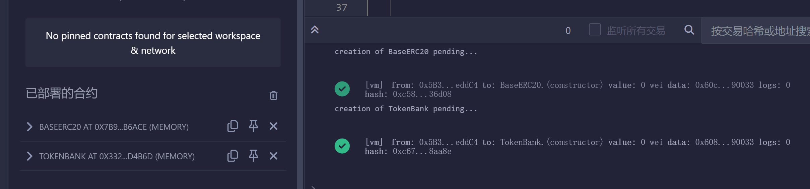
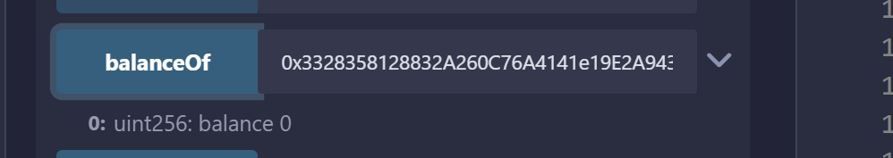
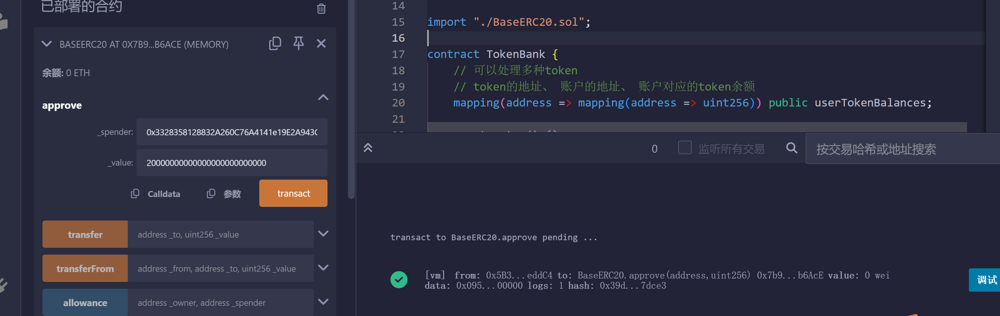
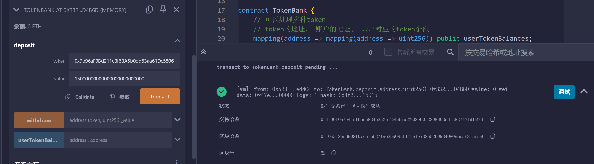
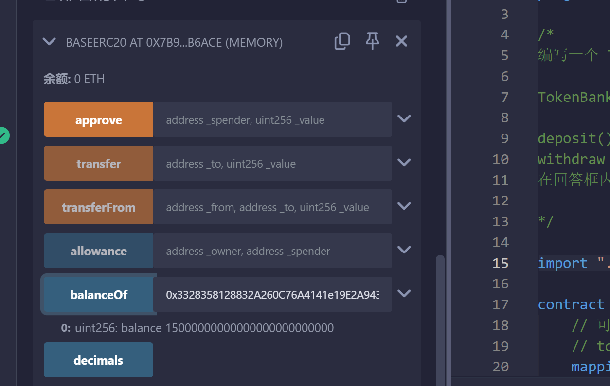
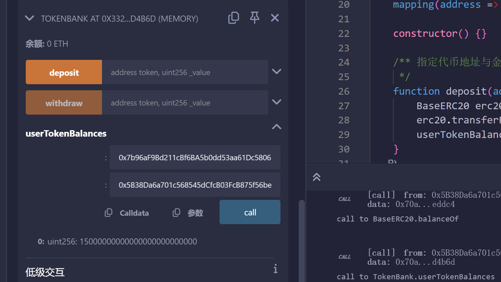

### 题面：

编写一个 TokenBank 合约，可以将自己的 Token 存入到 TokenBank， 和从 TokenBank 取出。

TokenBank 有两个方法：

deposit() : 需要记录每个地址的存入数量；
withdraw（）: 用户可以提取自己的之前存入的 token。
在回答框内输入你的代码或者 github 链接。

### 部分截图：

#### 1. 分别部署代币合约(0x7b96aF9Bd211cBf6BA5b0dd53aa61Dc5806b6AcE)与 TokenBank 合约(0x3328358128832A260C76A4141e19E2A943CD4B6D).

##### 

#### 2. 存款之前，查询 EOA(0x5B38Da6a701c568545dCfcB03FcB875f56beddC4) 与 bank 账户 里该代币的合约(前者有代币，后者为 0).

#####  

#### 3. EOA 调用代币合约的 approve 给银行合约授权：

##### 

#### 4. EOA 调用银行合约的 deposit 进行代币的存款（当存款数量超过被授权数量时会报错）(第一个参数是代币合约的地址)：

##### 

##### 

#### 5. 分别查询 EOA 在代币合约里的余额、银行在代币合约里的余额：

##### 

##### 

#### 6. 银行合约内部也记录了 EOA 账户的存款余额(第一个参数是代币合约的地址)，查询一下：

##### 
