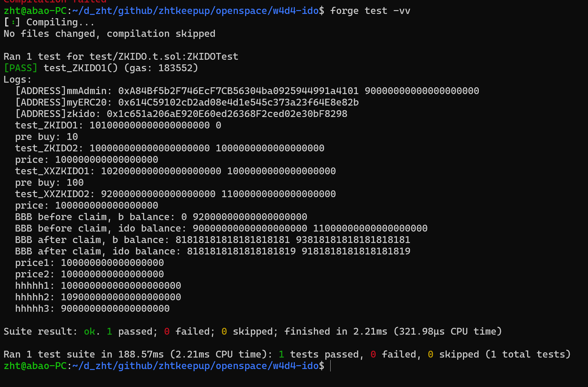

##

### 题面

编写 IDO 合约，实现 Token 预售，需要实现如下功能：

开启预售: 支持对给定的任意 ERC20 开启预售，设定预售价格，募集 ETH 目标，超募上限，预售时长。
任意用户可支付 ETH 参与预售；
预售结束后，如果没有达到募集目标，则用户可领会退款；
预售成功，用户可领取 Token，且项目方可提现募集的 ETH；
提交要求

编写 IDO 合约 和对应的测试合约
截图 foundry test 测试执行结果
提供 github IDO 合约源码链接

### 实现说明

预售时，当预售金额超过硬顶金额时，用户仍然可以参与，最终按用户投入金额比例计算可购买的实际份额，超出资金返还给用户。

### 测试截图:

