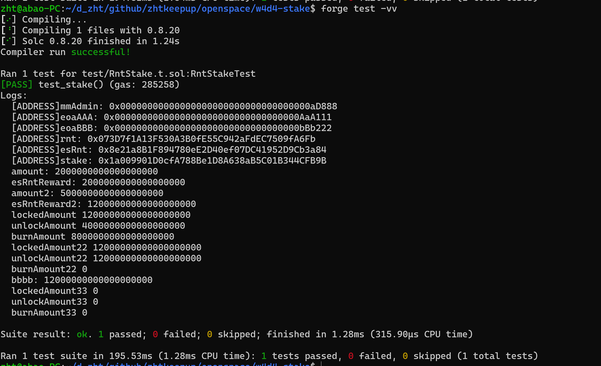

##

### 题面

编写一个质押挖矿合约，实现如下功能：

用户随时可以质押项目方代币 RNT(自定义的 ERC20) ，开始赚取项目方 Token(esRNT)；
可随时解押提取已质押的 RNT；
可随时领取 esRNT 奖励，每质押 1 个 RNT 每天可奖励 1 esRNT;
esRNT 是锁仓性的 RNT， 1 esRNT 在 30 天后可兑换 1 RNT，随时间线性释放，支持提前将 esRNT 兑换成 RNT，但锁定部分将被 burn 燃烧掉。

### 实现说明

### 测试截图:

