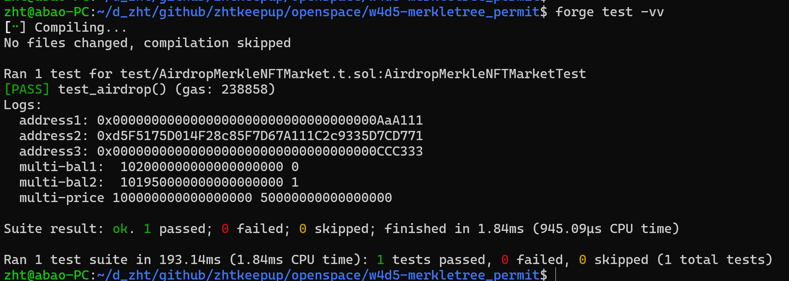

## 题目

**实现一个 airdropMerkleNFTMarket 合约(假定 Token、NFT、AirdopMerkleNFTMarket 都是同一个开发者开发)，功能如下：**

1. 基于 Merkel 树验证某用户是否在白名单中
2. 在白名单中的用户可以使用上架（和之前的上架逻辑一致）指定价格的优惠 50% 的 Token 来购买 NFT， Token 需支持 permit 授权。

**要求使用 multicall( delegateCall 方式) 一次性调用两个方法：**

1. permitPrePay() : 调用 token 的 permit 进行授权
2. claimNFT() : 通过默克尔树验证白名单，并利用 permitPrePay 的授权，转入 token 转出 NFT 。

## xxx

### 测试截图:

