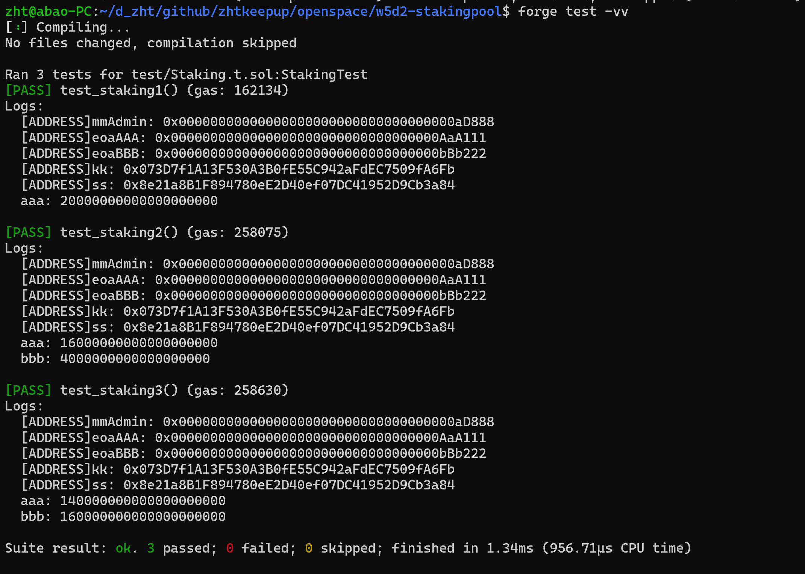
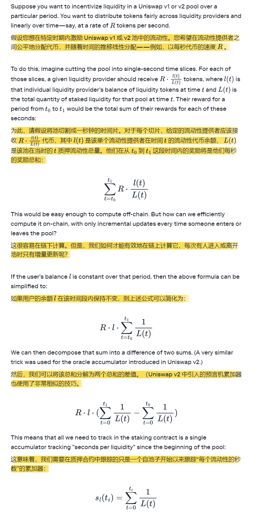

## 测试截图



## -------

## 附录

### 题目

编写 StakingPool 合约，实现 Stake 和 Unstake 方法，允许任何人质押 ETH 来赚钱 KK Token。其中 KK Token 是每一个区块产出 10 个，产出的 KK Token 需要根据质押时长和质押数量来公平分配。

下面是合约接口信息

```
/**
 * @title KK Token
 */
interface IToken is IERC20 {
    function mint(address to, uint256 amount) external;
}

/**
 * @title Staking Interface
 */
interface IStaking {
    /**
     * @dev 质押 ETH 到合约
     */
    function stake()  payable external;

    /**
     * @dev 赎回质押的 ETH
     * @param amount 赎回数量
     */
    function unstake(uint256 amount) external;

    /**
     * @dev 领取 KK Token 收益
     */
    function claim() external;

    /**
     * @dev 获取质押的 ETH 数量
     * @param account 质押账户
     * @return 质押的 ETH 数量
     */
    function balanceOf(address account) external view returns (uint256);

    /**
     * @dev 获取待领取的 KK Token 收益
     * @param account 质押账户
     * @return 待领取的 KK Token 收益
     */
    function earned(address account) external view returns (uint256);
}

```

### 奖励率累加原理

来源: https://www.paradigm.xyz/2021/05/liquidity-mining-on-uniswap-v3


